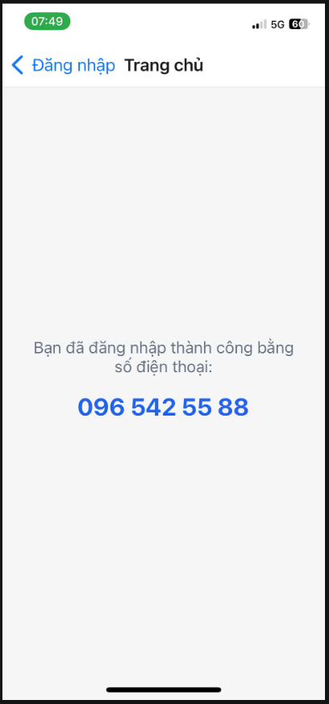

# Stack Navigation

Ứng dụng React Native sử dụng Expo để kiểm tra định dạng số điện thoại Việt Nam và chuyển sang `HomeScreen` khi người dùng nhập hợp lệ.

## Thông tin

- Nguyễn Hoàng Dũng - 23810310338

## Chức năng

- Format số điện thoại theo dạng `096 542 55 88`
- Hiển thị lỗi khi số điện thoại không đúng định dạng
- Điều hướng sang màn hình `Trang chủ` khi nhập đúng

## Ảnh minh họa

### 1. Số điện thoại sai định dạng

### 2. Số điện thoại hợp lệ

### 3. Màn hình Trang chủ

